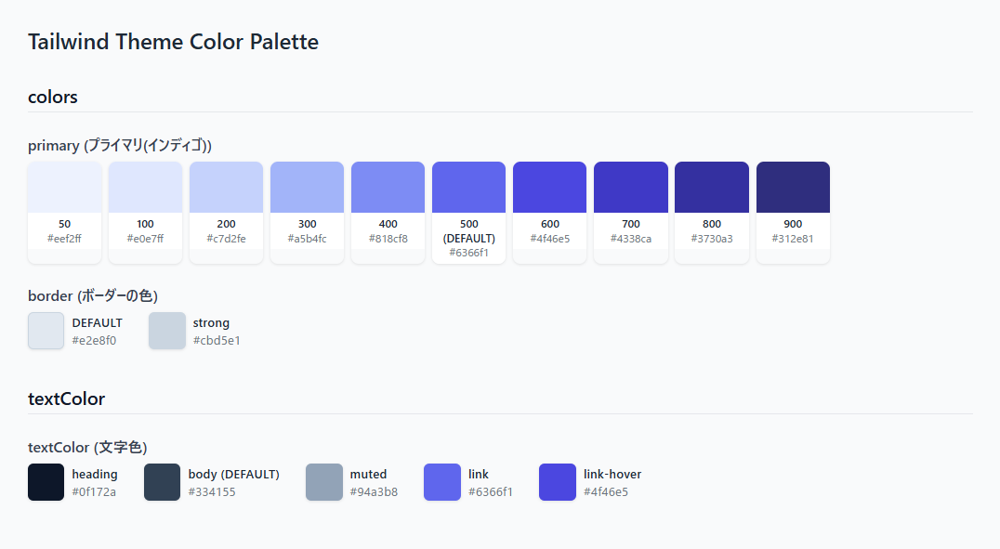

[English](README_en.md)

# tailwind-v3-palette
Tailwind CSS v3の設定ファイルからテーマの定義を読み取り、一覧性の高いHTMLカラーパレットを生成するCLIツール

## 特徴
- 設定ファイル内のコメント（`// テーマカラー` など）をセクション見出しに反映します
- カラーのキー構造に応じてカラーパレットを表示します

## 対応する設定ファイル形式
| ファイル名 | 形式 |
| --- | --- |
| tailwind.config.js | CommonJS |
| tailwind.config.cjs | CommonJS |
| tailwind.config.mjs | ES Modules |
| tailwind.config.ts | TypeScript |

## インストール
```bash
npm install -D tailwind-v3-palette
```

## 使い方
```bash
npx tailwind-v3-palette
```
または
```bash
npx t3p
```

デフォルトでは、プロジェクトルートに`color-palette.html`が出力されます

設定ファイルが以下の場合：
```js
export default {
  content: ["./src/**/*.{astro,html,js,jsx,md,mdx,svelte,ts,tsx,vue}"],
  theme: {
    extend: {
      colors: {
        // プライマリ(インディゴ)
        primary: {
          DEFAULT: "#6366f1",
          50: "#eef2ff",
          100: "#e0e7ff",
          200: "#c7d2fe",
          300: "#a5b4fc",
          400: "#818cf8",
          500: "#6366f1",
          600: "#4f46e5",
          700: "#4338ca",
          800: "#3730a3",
          900: "#312e81",
        },
        // ボーダーの色
        border: {
          DEFAULT: "#e2e8f0",
          strong: "#cbd5e1",
        },
      },
      // 文字色
      textColor: {
        DEFAULT: "#334155",
        heading: "#0f172a",
        body: "#334155",
        muted: "#94a3b8",
        link: "#6366f1",
        "link-hover": "#4f46e5",
      },
      spacing: {
        xs: "0.25rem",
        sm: "0.5rem",
        md: "1rem",
        lg: "1.5rem",
        xl: "2rem",
        "2xl": "3rem",
        "3xl": "4rem",
      },
    },
    fontFamily: {
      sans: ["Noto Sans JP", "sans-serif"],
      mono: ["JetBrains Mono", "monospace"],
    },
  },
};
```



## 設定
`package.json`に`tailwindV3Palette.output`を追加すると、出力先を変更できます
```json
{
  "tailwindV3Palette": {
    "output": "./styles/color-palette.html"
  }
}
```

## 動作環境
- Node.js 18以上

## 注意事項
- Tailwind CSS v4には対応していません。v3の設定ファイル形式のみサポートしています

## ライセンス
MIT
