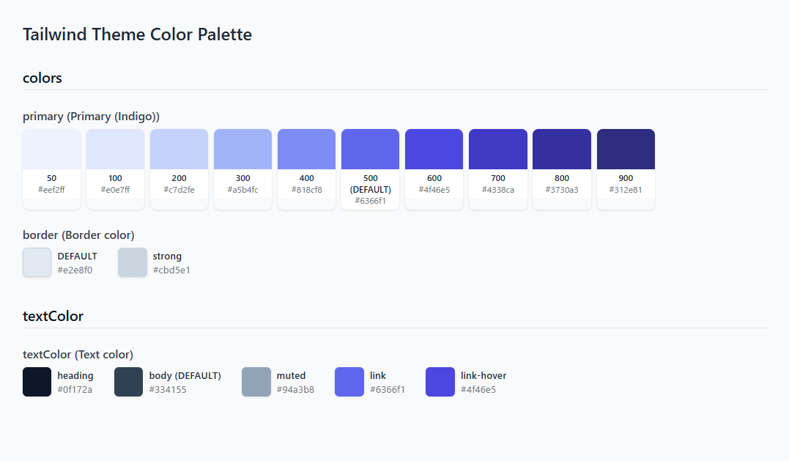

[Japanese](README.md)

# tailwind-v3-palette
A CLI tool that reads Tailwind CSS v3 config files and generates a well-organized HTML color palette.

## Features
- Reflects comments in the config file (e.g. `// Theme colors`) as section headings
- Displays the color palette according to the key structure of the colors

## Supported config file formats

| File name | Format |
| --- | --- |
| tailwind.config.js | CommonJS |
| tailwind.config.cjs | CommonJS |
| tailwind.config.mjs | ES Modules |
| tailwind.config.ts | TypeScript |

## Installation
```bash
npm install -D tailwind-v3-palette
```

## Usage
```bash
npx tailwind-v3-palette
```
or
```bash
npx t3p
```

By default, `color-palette.html` is generated in the project root.

Given the following config file:
```js
export default {
  content: ["./src/**/*.{astro,html,js,jsx,md,mdx,svelte,ts,tsx,vue}"],
  theme: {
    extend: {
      colors: {
        // Primary (Indigo)
        primary: {
          DEFAULT: "#6366f1",
          50: "#eef2ff",
          100: "#e0e7ff",
          200: "#c7d2fe",
          300: "#a5b4fc",
          400: "#818cf8",
          500: "#6366f1",
          600: "#4f46e5",
          700: "#4338ca",
          800: "#3730a3",
          900: "#312e81",
        },
        // Border color
        border: {
          DEFAULT: "#e2e8f0",
          strong: "#cbd5e1",
        },
      },
      // Text color
      textColor: {
        DEFAULT: "#334155",
        heading: "#0f172a",
        body: "#334155",
        muted: "#94a3b8",
        link: "#6366f1",
        "link-hover": "#4f46e5",
      },
      spacing: {
        xs: "0.25rem",
        sm: "0.5rem",
        md: "1rem",
        lg: "1.5rem",
        xl: "2rem",
        "2xl": "3rem",
        "3xl": "4rem",
      },
    },
    fontFamily: {
      sans: ["Noto Sans JP", "sans-serif"],
      mono: ["JetBrains Mono", "monospace"],
    },
  },
};
```



## Configuration
Add `tailwindV3Palette.output` to your `package.json` to change the output path.
```json
{
  "tailwindV3Palette": {
    "output": "./styles/color-palette.html"
  }
}
```

## Requirements
- Node.js 18 or later

## Note
- Tailwind CSS v4 is not supported. Only v3 config file formats are supported.

## License
MIT
